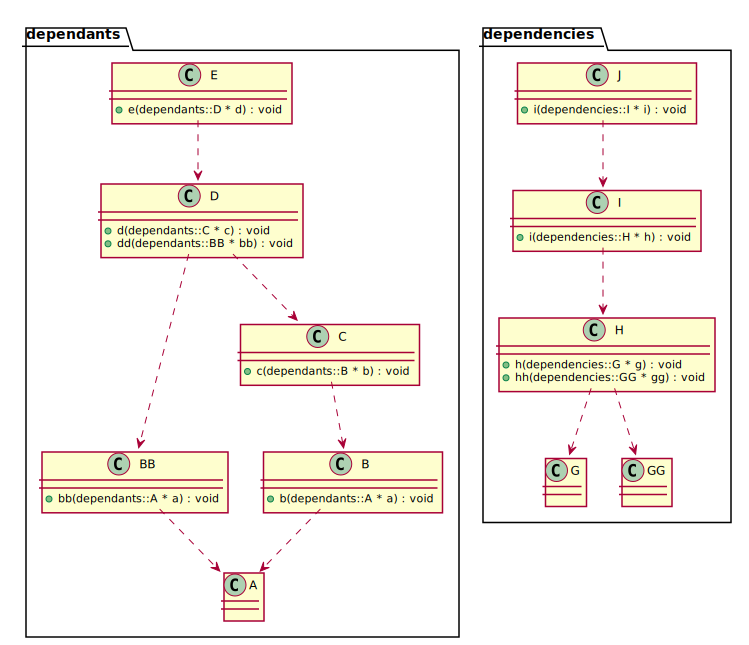

# Diagram filters

Diagram filters are at the core of generating diagrams with `clang-uml`, as they allow to fine tune the scope
of each diagram, and thus provide you with a several small, but readable diagrams instead of a single huge diagram
that cannot be effectively browsed, printed or included in an online documentation of your project.

Filters can be specified separate for each diagram, and they can be added as either `include` or `exclude` filters,
depending on which is more appropriate for a given diagram.

For instance to include only C++ entities from a namespace `ns1::ns2` but not `ns1::ns2::detail` add the following
to your diagram configuration:

```yaml
  include:
    namespaces:
      - ns1::ns2
  exclude:
    namespaces:
      - ns1::ns2::detail
```

The following filters are available.

## `namespaces`

Allows to include or exclude entities from specific namespaces.

## `elements`

Allows to directly include or exclude specific entities from the diagrams, for instance to exclude a specific class
from an included namespace:

```yaml
  include:
    namespaces:
      - ns1::ns2
  exclude:
    elements:
      - ns1::ns2::MyClass
```

## `context`

This filter allows to limit the diagram elements only to classes which are in direct relationship (of any kind) with
the specified class:

```yaml
  include:
    context:
      - ns1::ns2::MyClass
```


## `relationships`

This filter allows to include or exclude specific types of relationships from the diagram, for instance to only
include inheritance and template specialization/instantiation relationships add the following to the diagram:

```yaml
  include:
    relationships:
      - inheritance
      - instantiation
```

The following relationships can be used in this filter:
  * inheritance
  * composition
  * aggregation
  * ownership
  * association
  * instantiation
  * friendship
  * dependency

## `subclasses`

This filter allows to include or exclude all subclasses of a given class in the diagram.

## `specializations`

This filter allows to include or exclude specializations and instantiations of a specific template from the diagram.

## `dependants` and `dependencies`

These filters allow to specify that only dependants or dependencies of a given class should be included in the diagram.
This can be useful for analyzing what classes in your project depend on some other class, which could have impact for
instance on refactoring.

For instance the following code:
```cpp

namespace dependants {
struct A {
};

struct B {
    void b(A *a) { }
};

struct BB {
    void bb(A *a) { }
};

struct C {
    void c(B *b) { }
};

struct D {
    void d(C *c) { }
    void dd(BB *bb) { }
};

struct E {
    void e(D *d) { }
};

struct F {
};
} // namespace dependants

namespace dependencies {

struct G {
};

struct GG {
};

struct H {
    void h(G *g) { }
    void hh(GG *gg) { }
};

struct HH {
    void hh(G *g) { }
};

struct I {
    void i(H *h) { }
};

struct J {
    void i(I *i) { }
};
```

and the following filter:
```yaml
    include:
      dependants:
        - clanguml::t00043::dependants::A
      dependencies:
        - clanguml::t00043::dependencies::J
      relationships:
        - dependency
```

generates the following diagram:


