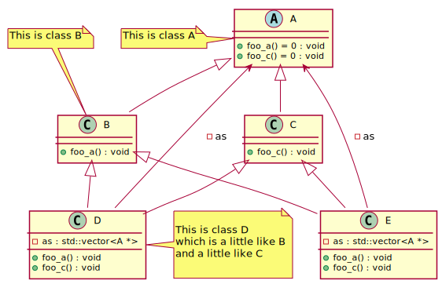

# t00002 - Basic class inheritance
## Config
```yaml
compilation_database_dir: ..
output_directory: puml
diagrams:
  t00002_class:
    type: class
    glob:
      - ../../tests/t00002/t00002.cc
    comment_parser: clang
    using_namespace:
      - clanguml::t00002
    include:
      namespaces:
        - clanguml::t00002
    plantuml:
      after:
        - ' note left of {{ e.alias }} : {{ trim(e.comment.brief.0) }}'
        - ' note top of {{ e.alias }} : {{ trim(e.comment.brief.0) }}'
        - |
          note right of {{ alias("D") }}
              {{ comment("D").text }}
          end note
```
## Source code
File t00002.cc
```cpp
#include <vector>

namespace clanguml {
namespace t00002 {

/// \brief This is class A
class A {
public:
    /// Abstract foo_a
    virtual void foo_a() = 0;
    /// Abstract foo_c
    virtual void foo_c() = 0;
};

/// \brief This is class B
class B : public A {
public:
    virtual void foo_a() override { }
};

/// @brief This is class C - class C has a long comment
///
/// Vivamus integer non suscipit taciti mus etiam at primis tempor sagittis sit,
/// euismod libero facilisi aptent elementum felis blandit cursus gravida sociis
/// erat ante, eleifend lectus nullam dapibus netus feugiat curae curabitur est
/// ad.
class C : public A {
public:
    /// Do nothing unless override is provided
    virtual void foo_c() override { }
};

/// This is class D
/// which is a little like B
/// and a little like C
class D : public B, public C {
public:
    /**
     * Forward foo_a
     */
    void foo_a() override
    {
        for (auto a : as)
            a->foo_a();
    }

    /**
     * Forward foo_c
     */
    void foo_c() override
    {
        for (auto a : as)
            a->foo_c();
    }

private:
    /// All the A pointers
    std::vector<A *> as;
};

class E : virtual public B, public virtual C {
public:
    ///
    /// Forward foo_a
    ///
    void foo_a() override
    {
        for (auto a : as)
            a->foo_a();
    }

    ///
    /// Forward foo_c
    ///
    void foo_c() override
    {
        for (auto a : as)
            a->foo_c();
    }

private:
    /// All the A pointers
    std::vector<A *> as;
};
} // namespace t00002
} // namespace clanguml

```
## Generated UML diagrams

