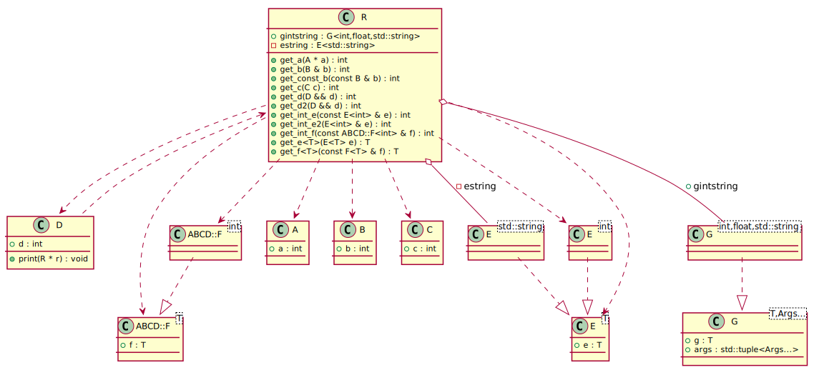

# t00013 - Template instantiation relationships
## Config
```yaml
compilation_database_dir: ..
output_directory: puml
diagrams:
  t00013_class:
    type: class
    glob:
      - ../../tests/t00013/t00013.cc
    using_namespace:
      - clanguml::t00013
    include:
      namespaces:
        - clanguml::t00013
        - ABCD

```
## Source code
File t00013.cc
```cpp
#include <algorithm>
#include <map>
#include <numeric>
#include <string>

namespace ABCD {
template <typename T> struct F {
    T f;
};
}
namespace clanguml {
namespace t00013 {

struct A {
    int a;
};

struct B {
    int b;
};

struct C {
    int c;
};

class R;

struct D {
    int d;
    void print(R *r) { }
};

template <typename T> struct E {
    T e;
};

using namespace ABCD;
class R {
public:
    int get_a(A *a) { return a->a; }
    int get_b(B &b) { return b.b; }
    int get_const_b(const B &b) { return b.b; }
    int get_c(C c) { return c.c; }
    int get_d(D &&d) { return d.d; }
    // Dependency relationship should be rendered only once
    int get_d2(D &&d) { return d.d; }

    template <typename T> T get_e(E<T> e) { return e.e; }
    int get_int_e(const E<int> &e) { return e.e; }
    int get_int_e2(E<int> &e) { return e.e; }

    template <typename T> T get_f(const F<T> &f) { return f.f; }
    int get_int_f(const F<int> &f) { return f.f; }

private:
    mutable E<std::string> estring;
};
}
}

```
## Generated UML diagrams

