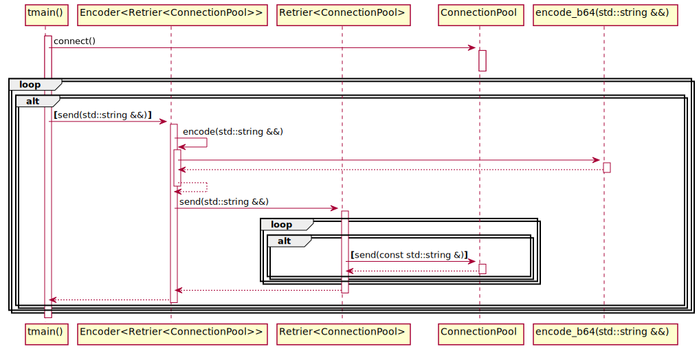

# t20029 - Combined feature sequence diagram test case
## Config
```yaml
compilation_database_dir: ..
output_directory: puml
diagrams:
  t20029_sequence:
    type: sequence
    glob:
      - ../../tests/t20029/t20029.cc
    include:
      namespaces:
        - clanguml::t20029
    exclude:
      access:
        - private
    using_namespace:
      - clanguml::t20029
    start_from:
      - function: "clanguml::t20029::tmain()"
```
## Source code
File t20029.cc
```cpp
#include <atomic>
#include <functional>
#include <iostream>
#include <memory>
#include <string>

namespace clanguml {
namespace t20029 {
using encoder_function_t = std::function<std::string(std::string &&)>;

std::string encode_b64(std::string &&content) { return std::move(content); }

template <typename T> class Encoder : public T {
public:
    bool send(std::string &&msg)
    {
        auto encoded = encode(std::move(msg));
        return T::send(std::move(encoded));
    }

protected:
    std::string encode(std::string &&msg) { return encode_b64(std::move(msg)); }

private:
    encoder_function_t f_;
};

template <typename T> class Retrier : public T {
public:
    bool send(std::string &&msg)
    {
        std::string buffer{std::move(msg)};

        int retryCount = 5;

        while (retryCount--) {
            if (T::send(buffer))
                return true;
        }

        return false;
    }
};

class ConnectionPool {
public:
    void connect()
    {
        if (!is_connected_.load())
            connect_impl();
    }

    bool send(const std::string &msg) { return true; }

private:
    void connect_impl() { is_connected_ = true; }

    std::atomic<bool> is_connected_;
};

int tmain()
{
    auto pool = std::make_shared<Encoder<Retrier<ConnectionPool>>>();

    pool->connect();

    for (std::string line; std::getline(std::cin, line);) {
        if (!pool->send(std::move(line)))
            break;
    }

    return 0;
}
}
}
```
## Generated UML diagrams

